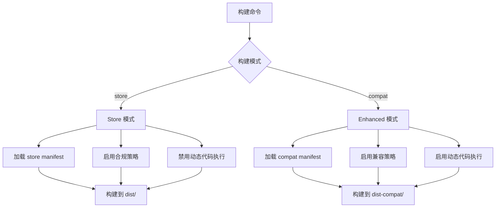

# CarryMonkey 双模式注入策略文档

## 概述

CarryMonkey 是一个现代化的 Chrome 扩展，用于管理和注入用户脚本（UserScript）。本文档详细描述了全新的双模式智能注入策略，该策略既保证了 Chrome Web Store 的合规性，又提供了最大的功能兼容性。

## 🚀 双模式架构

### **Store 版本** (默认)
- ✅ **完全符合 Chrome Web Store 规范**
- ✅ **UserScripts API 优先**
- ❌ **无动态代码执行**
- 🎯 **推荐给大多数用户**

### **Enhanced 版本** (兼容)
- ⚠️ **不用于 Chrome Web Store 提交**
- ✅ **最大兼容性**
- ✅ **CSP 绕过能力**
- 🎯 **适合高级用户和开发环境**

## 核心架构

### 1. 组件结构

```
src/
├── background.ts                    # Service Worker，核心注入逻辑
├── config/
│   ├── build-modes.ts              # 构建模式配置
│   └── feature-flags.ts            # 功能开关管理
├── manifest/
│   ├── base.ts                     # 基础 manifest 配置
│   ├── store.ts                    # 商店版 manifest
│   ├── compat.ts                   # 兼容版 manifest
│   └── index.ts                    # 动态导出
├── services/
│   ├── injection/
│   │   ├── compliant.ts            # 合规注入策略
│   │   ├── legacy.ts               # 兼容注入策略
│   │   └── engine.ts               # 统一注入引擎
│   ├── injection-strategy.ts       # 策略选择器
│   ├── userscripts-api.ts          # UserScripts API 管理器
│   └── parser.ts                   # UserScript 元数据解析
├── content-scripts/
│   └── api-bridge.ts               # API 桥接脚本
├── utils/
│   └── matcher.ts                  # URL 匹配逻辑
└── types.ts                        # 类型定义
```

### 2. 双模式构建流程



### 3. 智能注入流程

```mermaid
graph TD
    A[页面加载] --> B[UnifiedInjectionEngine]
    B --> C{检查构建模式}
    C -->|Store 模式| D[CompliantInjectionStrategy]
    C -->|Enhanced 模式| E[CompatibilityInjectionStrategy]
    
    D --> F[UserScripts API 优先]
    D --> G[chrome.scripting 降级]
    D --> H[无 eval() 使用]
    
    E --> I[尝试合规策略]
    E --> J[Script Tag 注入]
    E --> K[Function 构造器]
    E --> L[eval() 最后手段]
    
    F --> M[脚本执行]
    G --> M
    H --> M
    I --> M
    J --> M
    K --> M
    L --> M
```

## 智能注入策略

### 1. 策略选择器 (InjectionStrategySelector)

**核心功能**:
- 分析脚本的 `@grant`、`@run-at`、`@sandbox` 等元数据
- 检测 UserScripts API 可用性
- 根据脚本复杂度选择最优注入方式
- 提供策略评分机制用于优化

**选择逻辑**:
```typescript
export class InjectionStrategySelector {
  static selectStrategy(script: UserScript): InjectionStrategy {
    const grants = script.meta.grant || [];
    const hasGMAPIs = grants.length > 0 && !grants.every(g => g === 'none');
    const needsEarlyExecution = script.meta['run-at'] === 'document-start';
    const supportsUserScriptsAPI = this.checkUserScriptsAPISupport();

    if (needsEarlyExecution && hasGMAPIs && supportsUserScriptsAPI) {
      return { method: 'userscripts-dynamic', world: 'ISOLATED', timing: 'document_start' };
    }
    // ... 其他策略逻辑
  }
}
```

### 2. 三种注入模式

#### A. UserScripts Dynamic 模式
- **适用场景**: 需要 `document-start` 执行且有 GM API 需求
- **实现方式**: 直接将脚本代码注册到 UserScripts API
- **优势**: 真正的 `document-start` 支持，最佳性能
- **限制**: 需要 Chrome 支持 UserScripts API

#### B. UserScripts API 模式  
- **适用场景**: 有 GM API 需求但不需要早期执行
- **实现方式**: 注册包装器代码，通过消息传递获取脚本内容
- **优势**: 良好的隔离性，支持复杂 GM API
- **特点**: 延迟加载脚本内容

#### C. Content Script 模式
- **适用场景**: 简单脚本或 UserScripts API 不可用时的降级方案
- **实现方式**: 使用传统的 `chrome.scripting.executeScript`
- **优势**: 兼容性最好，支持所有 Chrome 版本
- **限制**: 无真正的 `document-start` 支持

### 3. UserScripts API 管理器

**核心功能**:
```typescript
export class UserScriptsAPIManager {
  static async registerScript(script: UserScript, strategy: InjectionStrategy): Promise<void>
  static async unregisterScript(scriptId: string): Promise<void>
  static async updateScript(script: UserScript, strategy: InjectionStrategy): Promise<void>
  static getRegisteredScripts(): string[]
}
```

**包装器生成**:
- 为 `userscripts-api` 模式生成智能包装器
- 支持 GM API 绑定和错误处理
- 提供脚本信息对象 (`GM_info`)

### 4. 执行环境智能判断

**新的判断逻辑**:
```typescript
const grants = script.meta.grant || [];
const hasGMAPIs = grants.some(g => g !== 'none');
const sandboxMode = script.meta.sandbox || 'raw';
const needsIsolation = sandboxMode !== 'raw' || hasGMAPIs;
```

**世界选择**:
- `MAIN`: 简单脚本，直接页面访问
- `ISOLATED`: 复杂脚本，安全隔离执行

### 5. 资源和依赖管理

**优化的缓存策略**:
- 依赖脚本在策略选择前预加载
- 资源文件按需缓存
- 支持批量脚本注册优化

**缓存键规范**:
- 依赖脚本: `required_script_${url}`
- 资源文件: `resource_${scriptId}_${resourceName}`
- 策略缓存: 存储在脚本元数据的 `_injectionStrategy` 字段

## 安全考虑

### 1. CSP 兼容性
- 优先使用 script 标签注入，支持 nonce 属性
- CSP 阻止时自动降级到 eval() 方法
- 支持 Trusted Types API

### 2. 域名白名单
- GM_xmlhttpRequest 需要在 `@connect` 中声明允许的域名
- 支持通配符 `*` 和子域名匹配

### 3. 脚本隔离
- 根据 grant 权限自动选择执行环境
- ISOLATED 环境提供更好的安全隔离

## 触发时机

### 1. 自动注入
- 监听 `chrome.tabs.onUpdated` 事件
- 在页面 `loading` 状态时进行匹配和注入
- 支持所有框架 (`allFrames: true`)

### 2. 手动注入
- 通过 popup 界面手动执行脚本
- 消息类型: `{ action: 'executeScript', tabId, script }`

## 性能优化

### 1. 缓存策略
- 脚本内容缓存避免重复解析
- 依赖脚本缓存避免重复下载
- 资源文件缓存减少网络请求

### 2. 异步处理
- 资源下载使用异步操作
- API 调用支持异步响应

### 3. 错误处理
- 注入失败时提供详细错误信息
- 资源加载失败时不阻止脚本执行
- 支持降级注入策略

## 扩展性

### 1. 新增 GM API
- 在 `API_HANDLERS` 中添加新的处理器
- 在 `api-bridge.ts` 中添加对应的客户端方法

### 2. 新增匹配模式
- 在 `matcher.ts` 中扩展 `patternToRegExp` 函数
- 支持更复杂的匹配规则

### 3. 新增执行环境
- 扩展 `injectScript` 函数支持新的 Chrome API
- 添加新的世界类型支持

## 关键代码位置

### 1. 智能注入引擎
- **文件**: `src/background.ts:InjectionEngine`
- **功能**: 智能注入策略执行器，支持多种注入模式

### 2. 策略选择器
- **文件**: `src/services/injection-strategy.ts:InjectionStrategySelector`
- **功能**: 根据脚本特性选择最优注入策略

### 3. UserScripts API 管理器
- **文件**: `src/services/userscripts-api.ts:UserScriptsAPIManager`
- **功能**: 封装 Chrome UserScripts API 的使用

### 4. 注入入口点
- **文件**: `src/background.ts:chrome.tabs.onUpdated`
- **功能**: 自动注入监听器，使用智能策略

### 5. 消息处理器
- **文件**: `src/background.ts:chrome.runtime.onMessage`
- **功能**: 处理手动注入和 API 调用

### 6. API 桥接
- **文件**: `src/content-scripts/api-bridge.ts`
- **功能**: 在隔离环境中提供 GM API

### 7. URL 匹配
- **文件**: `src/utils/matcher.ts`
- **功能**: patternToRegExp 和 matches 函数

## 故障排除

### 1. 注入失败
- 检查 URL 匹配模式是否正确
- 查看控制台是否有 CSP 错误
- 确认脚本是否已启用

### 2. API 调用失败
- 检查 grant 权限是否正确声明
- 确认 API Bridge 是否正确加载
- 查看 background 脚本错误日志

### 3. 资源加载失败
- 检查网络连接
- 确认资源 URL 是否可访问
- 查看缓存是否正常工作

## 性能优化

### 1. 策略缓存
- 脚本策略选择结果缓存在元数据中
- 避免重复计算策略选择逻辑
- 支持策略评分机制优化选择

### 2. 批量操作
- 支持批量脚本注册到 UserScripts API
- 减少 API 调用次数
- 优化大量脚本的注入性能

### 3. 降级机制
- UserScripts API 失败时自动降级到 Content Script
- 保证注入的可靠性
- 提供详细的错误日志

## 版本兼容性

### Chrome 扩展 API
- **Manifest V3**: 完全支持
- **UserScripts API**: Chrome 120+ 支持，自动检测可用性
- **chrome.scripting API**: 作为降级方案
- **执行世界**: 支持 ISOLATED 和 MAIN

### UserScript 兼容性
- **Greasemonkey**: 支持标准元数据语法
- **Tampermonkey**: 兼容高级特性如 @sandbox
- **GM API**: 支持常用 API，通过 API Bridge 实现

## 升级指南

### 从旧版本升级
1. **自动迁移**: 现有脚本会自动使用新的智能策略
2. **性能提升**: 支持 UserScripts API 的环境会获得更好性能
3. **兼容性**: 保持与现有脚本的完全兼容

### 开发者注意事项
1. **策略选择**: 系统会自动选择最优策略，无需手动干预
2. **调试信息**: 控制台会显示选择的策略和原因
3. **降级处理**: 在不支持的环境中会自动降级

## 未来规划

### 短期目标
1. **用户配置**: 允许用户手动选择注入策略
2. **性能监控**: 添加注入性能统计
3. **错误恢复**: 改进错误处理和恢复机制

### 长期目标
1. **AI 优化**: 基于使用模式智能优化策略选择
2. **扩展支持**: 支持更多浏览器和 API
3. **生态集成**: 与其他用户脚本管理器的互操作性
